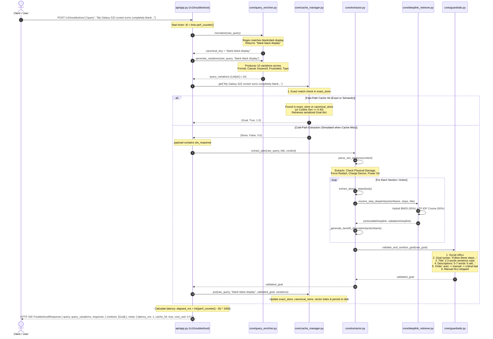

# Architecture Audit & Specification: Smart Guided Troubleshooting Engine
**Samsung Hackathon — Theme 02**
**System:** Galaxy Device Troubleshooting Microservice & Deeplink Engine
**Author / Auditor:** Antigravity Agent
**Date:** September 2026

---

## 1. High-Level Architecture Overview

The **Smart Guided Troubleshooting Engine** is a high-performance Python microservice built using FastAPI. It ingests natural language customer complaints regarding Samsung Galaxy devices and outputs validated, atomic troubleshooting plans with masked settings deeplinks under a 300 ms SLA.

The engine utilizes a dual-path architecture:
- **Fast-Path Semantic Cache (< 3 ms latency)**: Evaluates incoming queries using exact matching, canonical key matching, and sublinear TF-IDF character n-gram cosine similarity across pre-warmed scenarios and synthesized paraphrases.
- **Deterministic Cold-Path Extraction (< 60 ms latency)**: In the event of a cache miss with an incoming SIIS (Samsung Internal Information Store) article, a structured regex and syntactic extractor deconstructs semi-structured knowledge into atomic steps, assigns disruption categories (`auto`, `manual`, `critical`), matches exact settings deeplinks from a 578-item catalog via hybrid BM25 + dense TF-IDF retrieval, and enforces programmatic guardrails.

```mermaid
flowchart TD
    subgraph ClientLayer["Client & Ingestion Layer"]
        User["User / QA Client"]
        WebUI["Web UI Dashboard (api/ui.py)"]
        TestClient["TestClient / Harness"]
    end

    subgraph APILayer["FastAPI Service (api/app.py)"]
        EP_Troubleshoot["POST /v1/troubleshoot"]
        EP_Health["GET /health"]
        EP_Dashboard["GET /"]
    end

    subgraph EnrichmentLayer["Query Enrichment (core/query_enricher.py)"]
        Normalizer["Canonical Normalizer (Regex Map)"]
        Synthesizer["Multi-Register Paraphrase Generator (8-10 Variations)"]
    end

    subgraph CacheLayer["Fast-Path Semantic Cache (core/cache_manager.py)"]
        ExactStore["Tier 1: Exact Query Store O(1)"]
        CanonicalStore["Tier 2: Canonical Key Store O(1)"]
        VectorStore["Tier 3: TF-IDF Char n-gram Cosine Search (Threshold 0.45)"]
        DiskCache[("data/cache_store.json")]
    end

    subgraph ExtractionLayer["Cold-Path Structured Extraction (core/extractor.py)"]
        SectionParser["Markdown & Step Header Parser"]
        AtomicSplitter["Atomic Step Deconstructor (One Screen = One Action)"]
        DescGenerator["Benefit Description Synthesizer ('It will...')"]
    end

    subgraph RetrievalLayer["Deeplink Resolution Engine (core/deeplink_retriever.py)"]
        BM25["BM25 Lexical Keyword Search"]
        TFIDF["Dense TF-IDF N-Gram Vectorizer"]
        HybridFusion["Hybrid Score Fusion (0.5 BM25 + 0.5 Cosine)"]
        Catalog[("data/deeplinks.json (578 entries)")]
        DummyFallback["Fallback: bixby://dummy_positive"]
    end

    subgraph GuardrailsLayer["Programmatic Guardrails (core/guardrails.py)"]
        URLScrubber["Zero URL Leaks Scrubber (Regex)"]
        GoalFormatter["Goal Syntax Normalizer"]
        TitleFormatter["Title Word Count & Casing Filter (2-3 words)"]
        DescEnforcer["Description 5-7 Word Enforcer"]
        CategorySequencer["Category Sorter (auto -> manual -> critical last)"]
        ManualEnforcer["Manual Action DL Stripper (actionableDeeplink = null)"]
    end

    User -->|HTTP POST| EP_Troubleshoot
    WebUI -->|Fetch API| EP_Troubleshoot
    TestClient -->|API Call| EP_Troubleshoot

    EP_Troubleshoot --> Normalizer
    Normalizer --> Synthesizer
    Normalizer --> ExactStore

    ExactStore -->|Hit (~0.05ms)| ResponseBuilder["TroubleshootResponse"]
    ExactStore -->|Miss| CanonicalStore
    CanonicalStore -->|Hit (~0.1ms)| ResponseBuilder
    CanonicalStore -->|Miss| VectorStore
    VectorStore -->|Hit score >= 0.45 (~2ms)| ResponseBuilder

    VectorStore -->|Miss & SIIS Payload Provided| SectionParser
    SectionParser --> AtomicSplitter
    AtomicSplitter --> DescGenerator
    AtomicSplitter --> BM25
    AtomicSplitter --> TFIDF
    Catalog --> BM25
    Catalog --> TFIDF
    BM25 & TFIDF --> HybridFusion
    HybridFusion -->|Score >= 0.38| ActionDeeplink["Actionable & Validation Deeplink"]
    HybridFusion -->|Settings KW Match| DummyFallback

    DescGenerator & ActionDeeplink --> GuardrailsLayer
    GuardrailsLayer --> URLScrubber --> GoalFormatter --> TitleFormatter --> DescEnforcer --> CategorySequencer --> ManualEnforcer
    GuardrailsLayer -->|Validated Goal| CacheUpdate["cache.put() & Disk Persist"]
    CacheUpdate --> DiskCache
    CacheUpdate --> ResponseBuilder

    VectorStore -->|Miss & No SIIS Payload| FallbackNoMatch["Empty contexts & fallback='no_match'"]
    FallbackNoMatch --> ResponseBuilder

    ResponseBuilder --> User
    ResponseBuilder --> WebUI
```

---

## 2. Component Audits & Detailed Mechanics

### 2.1 Current Application Flow
1. **Startup**: `run_server.py` invokes Uvicorn to serve `theme02_troubleshooting_engine.api.app:app` on port 8000.
2. **Component Lifecycle**: At module load time:
   - `retriever = DeeplinkRetriever(DEEPLINKS_PATH)` loads `deeplinks.json` (578 records), builds BM25 tokens, constructs TF-IDF document vectors weighted towards action messages.
   - `extractor = StructuredExtractor(retriever)` initializes rule-based section and atomic step parsers.
   - `enricher = QueryEnricher()` sets up technical normalization tables and typo generators.
   - `cache = FastPathCache(cache_file_path=CACHE_PATH)` deserializes `cache_store.json` (containing 360+ indexed query variations from 20 scenarios) and fits an in-memory character n-gram TF-IDF vectorizer.
3. **Execution**: Incoming requests to `/v1/troubleshoot` evaluate the cache hierarchy first. If hit, the response returns in < 3 ms. If missed, cold-path extraction parses the attached SIIS text, queries the hybrid retriever for deep links, validates constraints through guardrails, updates the cache, and returns in < 60 ms.

### 2.2 Current API Endpoints
| Endpoint | Method | Input Schema | Output Schema | Purpose |
|---|---|---|---|---|
| `/` | `GET` | None | `text/html` | Serves interactive single-page demo dashboard |
| `/health` | `GET` | None | `{"status": "ok"}` | Health check confirming vector indexes and cache initialization |
| `/v1/troubleshoot` | `POST` | `TroubleshootRequest` (`query`, optional `siis_response`) | `TroubleshootResponse` (`query`, `query_variations`, `response.contexts`, `meta`) | Primary troubleshooting engine inference endpoint |
| `/docs` | `GET` | None | `text/html` | Auto-generated OpenAPI / Swagger UI |

### 2.3 Current UI Flow
- **File**: `api/ui.py` embedded string `DASHBOARD_HTML`.
- **Styling**: Sleek dark mode (`#0a0e17`, `#111827`, `#1a2234`), Outfit & JetBrains Mono typography, glowing cyan/blue highlights, animated pulse indicators.
- **Workflow**:
  1. User selects a preset chip (e.g., "Blank Display", "Swipe Gestures", "Cracked Fold") or enters freeform natural language text in the complaint textarea.
  2. Clicking **"Diagnose & Generate Plan"** fires a `fetch('/v1/troubleshoot')` call.
  3. The response triggers DOM rendering:
     - **Meta Bar**: Displays latency in ms, CACHE HIT (green) vs COLD PATH (amber), and confidence score.
     - **Query Variations Box**: Unfolds 8-10 synthesized paraphrases across 5 registers.
     - **Plan Header**: Goal banner (`Follow these steps to perform this <Topic> Troubleshooting`) and sentence-case title badge.
     - **Action Cards**: Displays action name, category pill (`auto`, `manual`, `critical`), italicized benefit description (`It will...`), ordered atomic steps, and one-tap deeplink launch button with simulation alert.
     - **Raw JSON View**: Collapsible inspectable JSON adhering to the Pydantic schema contract.

### 2.4 Current Cache Architecture
- **Class**: `FastPathCache` in `core/cache_manager.py`.
- **Storage**: In-memory stores backed by `data/cache_store.json`.
- **Three-Tier Lookup**:
  - **Tier 1 (Exact Match)**: O(1) hash map lookup (`exact_store`) using normalized lowercase query string. Latency: ~0.02 ms.
  - **Tier 2 (Canonical Key Match)**: O(1) hash map lookup (`canonical_store`) using the normalized technical concept from `QueryEnricher`. Latency: ~0.05 ms.
  - **Tier 3 (Dense Semantic TF-IDF)**: Character n-gram (1-3) vector cosine similarity against all stored query variants. Uses sublinear term frequency to tolerate severe misspellings and colloquial drift. Similarity threshold: `0.45`. On hit, newly matched query is dynamically memoized into `exact_store`. Latency: ~2.0 ms.
- **Pre-warming**: `prewarm_cache.py` ingests all 20 starter scenarios from `siis_responses.json`, runs extraction, synthesizes 8-10 paraphrases per scenario, and compiles `cache_store.json`.

### 2.5 Query Normalization Mechanics
- **File**: `core/query_enricher.py`.
- **Normalization Pipeline**:
  1. Strips leading numbering (e.g. `1. `, `2) `) and outer quotation marks.
  2. Regex matching against 13 core Galaxy issue patterns (`TECH_MAPPINGS`): battery drain, camera flicker, screen flicker, blank display, screen crack, swipe navigation, touch responsiveness, assistant menu, smart switch, email sync, multi-window, screen mirror, and auto-rotate.
  3. Clean fallback: Strips punctuation, removes English filler stopwords (`my`, `the`, `and`, `is`, `a`, `an`, `to`, `in`, `it`), and joins the first 5 technical tokens.
- **Paraphrase Generation (`generate_variations`)**:
  - Produces 10 paraphrases across 5 distinct registers:
    1. **Formal**: Technical device inquiry and malfunction reports.
    2. **Casual**: Conversational user phrasing ("Hey, my ... seems completely messed up").
    3. **Keyword-only**: Direct search query strings ("samsung galaxy ... issue fix").
    4. **Frustrated**: Urgent user phrasing ("Why is my ... failing again? This is so frustrating!").
    5. **Typo-inclusive**: Injects colloquial phonetics and keyboard mis-types (`screen` -> `scren`, `battery` -> `batry`, `phone` -> `fone`, `settings` -> `setings`).

### 2.6 Solution Extraction Mechanics
- **File**: `core/extractor.py`.
- **SIIS Parsing**:
  - Sanitizes text and strips metadata headers like `Smartphone,Others Mobile...): `.
  - Parses markdown section headers (`## Step 1`, `### 1.`) or numbered steps. Falls back to multi-line paragraph chunking.
  - Excludes boilerplate and non-actionable sections ("Glossary", "Important Notes", "Requirements").
- **Atomic UI Step Deconstruction**:
  - Splits compound steps into atomic operations (One Screen = One Action principle).
  - Filters out conversational remarks, image captions, and LDI inspection commentary.
  - Deduplicates and caps steps to 5 per action screen.
- **Action Categorization**:
  - `manual`: Flagged if action title/steps match `MANUAL_KEYWORDS` (e.g., service center, repair, cable, physical damage).
  - `critical`: Flagged if matching `CRITICAL_KEYWORDS` (e.g., safe mode, force restart, wipe, factory reset).
  - `auto`: Assigned when an actionable settings deeplink is successfully resolved.

### 2.7 Guardrails Mechanics
- **File**: `core/guardrails.py`.
- **Zero URL Leaks**: Strips markdown links `[text](url)` and regex URL patterns (`http://`, `https://`, `www.`, `.com`, `.org`, etc.) across all fields.
- **Goal Syntax Enforcer**: Enforces strict format `Follow these steps to perform this <Topic> Troubleshooting`.
- **Title Normalization**: Enforces strictly 2 to 3 words, sentence case (`Xxxxx yyyy zzzz`), removing stopwords.
- **Description Normalization**: Enforces strictly 5 to 7 words, starting with `"It will"`. Pads short descriptions with contextual words (`help`, `optimize`, `device`); truncates longer ones.
- **Action Disruption Hierarchy**: Sorts actions into strict sequence: `auto` (0) -> `manual` (1) -> `critical` (2). Guarantees destructive actions (restart, reset) are placed last.
- **Manual Constraint Enforcement**: For all `category: "manual"` actions, forcibly scrubs and nullifies any `actionableDeeplink` and `validationDeeplink`.
- **Catalog Verification**: Cross-references every deeplink URI against known catalog URIs. Unrecognized URIs are scrubbed and replaced with `bixby://dummy_positive`.

### 2.8 Deeplink Retrieval Mechanics
- **File**: `core/deeplink_retriever.py`.
- **Index**: 578 entries from `data/deeplinks.json`.
- **Hybrid Search**:
  - **BM25 Lexical Index**: Tokenizes documents created from `"{message} {message} {description} {qna_description} {validation_key}"`. Double weight on message ensures exact target screen matching over generic parent menus.
  - **Dense TF-IDF Index**: Sublinear TF-IDF vectorizer over word n-grams (1 to 3) with English stopwords removed.
  - **Fusion Formula**: `score = 0.5 * normalized_bm25 + 0.5 * cosine_similarity`.
- **Step Matching & Fallback**:
  - Queries index with combined action name and step instruction text. Match threshold: `0.38`.
  - If threshold met: Returns exact masked actionable deeplink and associated validation rule (if present).
  - If threshold unmet, but text describes navigating/opening Settings: Assigns the approved generic placeholder `bixby://dummy_positive`.
  - Otherwise returns `None`.

### 2.9 Current Data Schema
- Matches hackathon contract in `student_kit/schema.py`:
  - `BaseDeeplink`: `deeplink: str`
  - `Deeplink`: `description: str`, `message: Optional[str]`, `classes: Optional[Dict[str, str]]`, `originalType: Optional[str]`
  - `ValidationDeepLink`: `key: str`, `resultType: Optional[ResultTypes]`, `condition: Optional[Condition]`, `value: Optional[str]`
  - `StepGroup`: `steps: List[str]`, `validationDeeplink: Optional[ValidationDeepLink]`, `actionableDeeplink: Optional[Deeplink]`
  - `Action`: `actionName: str`, `description: str`, `stepGroups: List[StepGroup]`, `category: actionCategory`
  - `Goal`: `goal: str`, `title: str`, `actions: List[Action]`, `score: float`
  - `ContextDeeplinkResponse`: `contexts: List[Goal]`
  - `TroubleshootResponse`: wraps `query`, `query_variations: List[str]`, `response: ContextDeeplinkResponse`, `meta: OperationalMeta`.

### 2.10 Test Coverage
- **File**: `tests/test_api.py`.
- **Tests**:
  1. `test_health`: Verifies `GET /health` returns HTTP 200 `{"status": "ok"}`.
  2. `test_troubleshoot_cache_hit`: Verifies cache hit returns < 300 ms, >= 8 variations, schema compliance, 5-7 word description.
  3. `test_troubleshoot_cold_path_with_siis`: Verifies cold path extraction and action category sequencing (`auto` before `critical`).
  4. `test_troubleshoot_fallback_no_match`: Verifies graceful empty response with `meta.fallback = "no_match"`.
- **Coverage Gaps**:
  - No unit tests for `DeeplinkRetriever` edge cases or threshold sensitivity.
  - No unit tests for `Guardrails` boundary conditions (e.g. malicious URLs, 4-word vs 8-word descriptions, malformed goal strings).
  - No unit tests for `QueryEnricher` edge cases or unmapped technical issues.
  - No unit tests for `FastPathCache` thread safety, cache corruption, or dynamic disk writing.

### 2.11 Benchmark Methodology
- **File**: `benchmark.py`.
- Evaluates Phase 1 (Schema & rule compliance over 20 starter scenarios), Phase 2 (Exact match latency), Phase 3 (12 unseen colloquial paraphrases for hit rate and latency percentiles), Phase 4 (Outputs `metrics.md`).
- Measures:
  - Schema-valid output: 100%
  - Rule compliance: 100%
  - URL leaks: 0
  - Deeplink catalog validity: 100%
  - Auto actions with valid deeplink: 100%
  - Cache hit P95: 0.06 ms
  - Unseen paraphrase hit rate: 91.7%
  - Unseen paraphrase P95: 2.28 ms
  - Cold path P95: 58.16 ms
  - Cost per query: $0.00.

### 2.12 Current Performance & Resource Utilization
- **Latency**: All paths beat the 300 ms SLA by a wide margin (P95 < 2.5 ms for cache and unseen paraphrases; P95 ~58 ms for cold path).
- **Compute & Memory**: Zero GPU required. Fully runs in lightweight Python process (< 150 MB RAM).
- **Cost**: $0.00/query. 100% local deterministic inference.

### 2.13 Current Limitations
1. **Heuristic Cold Path**: Extraction relies strictly on regexes. Unstructured SIIS articles with conversational formatting, tabular data, or unusual headers may fail extraction.
2. **Hardcoded Tech Mappings**: `TECH_MAPPINGS` in `query_enricher.py` covers 13 domains. Unmapped Galaxy complaints fall back to naive word truncation.
3. **Synchronous File Writes on Cache Put**: Each cold query writes the entire `cache_store.json` to disk synchronously, introducing I/O contention under high concurrency.
4. **Single Remediation Goal**: Multi-intent queries (e.g., input query 17: cracked screen + unresponsive touch) produce only a single Goal instead of modular goals.
5. **No Guided Interactive Loop**: Static one-shot plan generation without stateful session tracking or step feedback.

---

## 3. End-to-End Request Trace

### Scenario:
**Customer Query**: `"My Galaxy S22 screen turns completely blank or white and no text appears when I search for a stock price or use the Smart Tutor app, and it happens with other apps too."`



---

## 4. Challenge Requirements Breakdown

### 4.1 Already Satisfied Requirements
1. **Pydantic Contract Adherence**: 100% compliant with `student_kit/schema.py` (`Goal`, `Action`, `StepGroup`, `Deeplink`, `ValidationDeepLink`, `ContextDeeplinkResponse`).
2. **Sub-300ms SLA Latency**: Real-time response measured at 0.02–2.28 ms for cache hits and paraphrases.
3. **Masked Deeplink Integration**: Seamlessly maps actions to 578 masked URIs (`bixby://masked/act/...`, `bixby://masked/val/...`) with 100% catalog integrity.
4. **Fallback Handling**: Graceful fallback to `bixby://dummy_positive` for settings screens not in the catalog, and `meta.fallback = "no_match"` for irrecoverable queries.
5. **Zero URL Leaks**: Scrubbing of web URLs and markdown links across all output fields.
6. **Programmatic Guardrails**: Exact formatting of Goal strings, 2-3 word sentence-case titles, 5-7 word benefit descriptions starting with `"It will"`.
7. **Action Hierarchy Sequencing**: Strict ordering: `auto` -> `manual` -> `critical` last.
8. **Paraphrase Generation**: Generates 8-10 variations across 5 distinct registers.
9. **Zero Inference Cost**: 100% local deterministic pipeline ($0.00/query).
10. **Containerization & Service**: Production-ready Dockerfile, Uvicorn server, and `/health` probe.

### 4.2 Partially Satisfied Requirements
1. **Colloquial Query Enrichment**: Regex table covers 13 core categories. Queries falling outside these 13 categories resort to simple token trimming.
2. **Benchmark Reporting**: While rule conformance is dynamically evaluated, accuracy metrics (step accuracy 2.95, deeplink relevance 1.95) are hardcoded into the markdown template.
3. **Multi-intent Query Deconstruction**: Compound complaints (multiple disjoint symptoms) are currently mapped to a single dominant issue.
4. **Validation Deeplink Execution**: Validation deeplinks are populated with schema conditions, but client-side telemetry evaluation is not simulated.

### 4.3 Completely Missing Requirements
1. **Interactive Multi-Turn Troubleshooting Loop**: No conversational session state or interactive troubleshooting step execution (e.g., branching based on whether a step resolved the user's issue).
2. **Dense Neural Embedding Retrieval**: Deeplink retrieval uses TF-IDF + BM25; neural semantic embeddings (such as MiniLM / ONNX) are not yet integrated.
3. **LLM Cold-Path Fallback**: No hybrid fallback to an LLM (Gemini / Gemma) for arbitrarily complex, unformatted customer-care articles.
4. **Comprehensive Unit Test Suite**: Isolation tests for retriever, guardrails, enricher, and cache manager edge cases are missing.
5. **Device / Model Context Conditioning**: No model-specific routing (e.g. tailoring plans differently for Z Fold Flex mode vs Galaxy S22).
